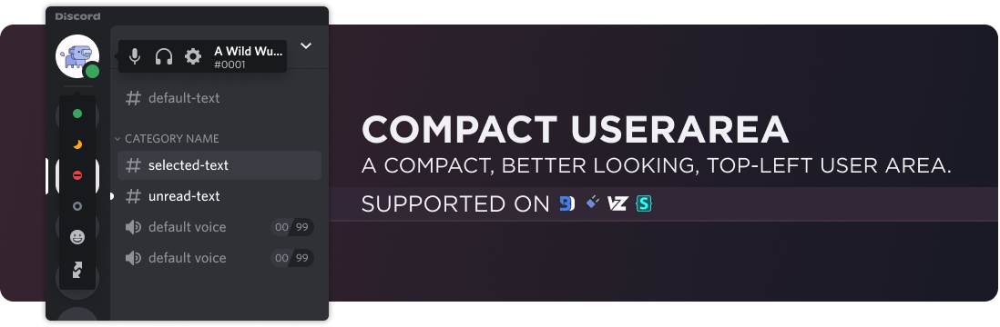

# Downloads
### **[Powercord](https://powercord.dev/) & [Vizality](https://vizality.com/)**
Head over to your **Themes folder -> open your terminal of choice -> copy-paste the following, then press enter**:
```
https://github.com/discord-extensions/compact-userarea
```

### **[BetterDiscord](https://betterdiscord.app/)**
- [Direct Download](https://github.com/discord-extensions/compact-userarea/releases/download/betterdiscord/CompactUserarea.theme.css)
- [Source](https://discord-extensions.github.io/compact-userarea/src/source.css)

### **Stylus**
1. Install the browser extension for your respective browser.
    - [Chrome Webstore](https://chrome.google.com/webstore/detail/stylus/clngdbkpkpeebahjckkjfobafhncgmne)
    - [Firefox Addons](https://addons.mozilla.org/en-US/firefox/addon/styl-us/)
2. Once you have the browser extension, head over to [this link](https://github.com/discord-extensions/compact-userarea/raw/main/clients/stylus/modern-indicators.user.css). It will open a new window to the page to install the style.
3. Press the "Install Style" button.

# Conflicting Issues
Before you make an issue on this repo about something being positioned incorrectly, please make sure you check any themes / quick css / plugins that you have enabled for conflicting CSS. You should look out for anything that messes with either the user area or guild list. In most cases, I am unable to add support for stuff that conflicts with it. It is up to you to modify it to work best in your case.

Below are some known themes / plugins that will cause conflict with this theme addon.
- [Sidebar Zoom](https://github.com/HooferDevelops/sidebar-zoom) will cause the top-left to be blank (not too sure if this happens anymore as of 11/25/2021).
- [Harmony Discord](https://github.com/KraXen72/harmony-discord) just flatout breaks everything.
- [Frosted Glass](https://github.com/DiscordStyles/FrostedGlass) may cause some things to be positioned incorrectly, pretty much making it unuseable.
- [Spotify Discrd](https://github.com/CapnKitten/Spotify-Discord) will have slight displacement with the avatar, status picker items will be messed up, and the bar at the bottom will be a bit broken because the userarea is moved.
- [Horizontal Sever List](https://github.com/DiscordStyles/HorizontalServerList) will interfere with the buttons and overlap with the server list, making it difficult to press some things.
- [Lavender](https://github.com/Lavender-Discord/Lavender) will make the userarea entirely disappear.

# Support Server
If you are having any issues with the theme, feel free to join the [support server](https://discord.gg/vYdXbEzqDs), or make an issue on this repository.