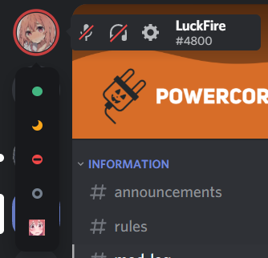

# Revamped User Area
A compact, better looking, user area.



# Installation & Updating
For installation, go to **Themes -> Open a CMD / Powershell / Terminal / Gitbash** in the folder, and enter the following:
```
git clone https://github.com/LuckFire/RevampedUserArea
```

Since Powercord's updater is currently broken, you have to update the theme manually. In order to do this, go to **Themes -> RevampedUserArea -> Open a CMD / Powershell / Terminal / Gitbash** in the folder, and enter the following:
```
git pull
```
