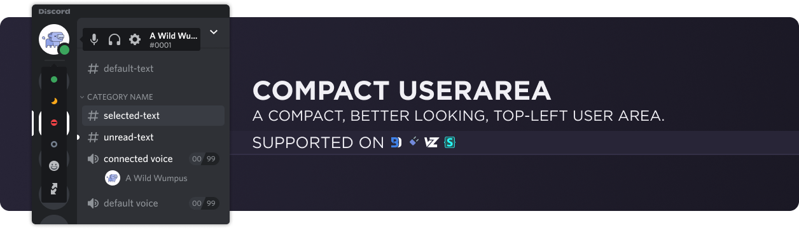
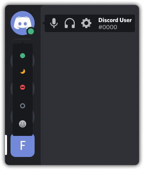

# Revamped User Area
A compact, better looking, user area. This addon looks best with Gibbu's [Radial Status](https://github.com/DiscordStyles/RadialStatus).



# Installation
For Powercord or Vizality installation, go to **Themes -> Open a CMD / Powershell / Terminal / Gitbash** in the folder, and enter the following:
```
git clone https://github.com/Discord-Theme-Addons/compact-userarea
```

**For BetterDiscord:**
- [Direct Dowload](https://betterdiscord.net/ghdl?id=3656)
- [View Source](https://raw.githack.com/Discord-Theme-Addons/compact-userarea/main/src/support/CompactUserarea.theme.css)

**For Browser / Web:**
1. Install the Stylus extension for [Chrome](https://chrome.google.com/webstore/detail/stylus/clngdbkpkpeebahjckkjfobafhncgmne) / [Firefox](https://addons.mozilla.org/en-US/firefox/addon/styl-us/) / [Opera](https://github.com/openstyles/stylus/wiki/Opera,-Outdated-Stylus).
2. After installing, head over to [this link](https://raw.githack.com/Discord-Theme-Addons/compact-userarea/main/src/support/CompactUserarea.user.css).
3. Press the "Install Style" button.

# Support for BottomBar
If you're using [BottomBar](https://github.com/Discord-Theme-Addons/bottom-bar) (another theme add-on by me), there will be compatibility issues. In order to fix this, head over to `./src/_base.scss`, open the file then add a new line at the bottom that is:
```css
@import "./support/bottombar-support";
```

# Issues
Here is a list of plugins/themes/css that can cause issues with this addon. If you're still having issues, you can either make an issue request, ping me in the Powercord server, or DM me on Discord.

- If the top left is blank, it's most likely because you have [Hoofer's Sidebar Zoom](https://github.com/HooferDevelops/sidebar-zoom)
- [Harmony Discord](https://github.com/KraXen72/harmony-discord) breaks everything with it. 
- [Frosted Glass](https://github.com/DiscordStyles/FrostedGlass) will have positioning issues.
- If the status picker icons are enlarged and misplaced, it's most likely because you have Compact status Menu.
- Anything else that messes with the status picker/action buttons/avatar.

Make sure you check all of the above before messaging me or making an issue on this repo.
