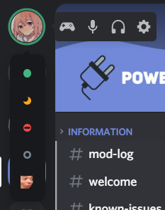

# RevampedUserArea
A compact, better looking user area.



# Installation
For installation, go to **Themes -> Open CMD / Powershell / Terminal / Gitbash**, and enter the following:
```
git clone https://github.com/LuckFire/RevampedUserArea
```

# Other Support Installation
If you're using Bottom Bar (another theme made by me), this is most likely going to break. I've made a separate version for it, so if you're using it, you should install this version instead by going into **Themes -> Open CMD / Powershell / Terminal / Gitbash** and entering the following:
```
git clone --single-branch --branch BottomBar https://github.com/LuckFire/RevampedUserArea
```

# Issues
Here is a list of plugins/themes/css that can cause issues with this addon. If you're still having issues, make and issue request, ping me in the Powercord server or DM me on Discord.

- If the top left is blank, it's most likely because you have Hoofer's Sidebar Zoom (https://github.com/HooferDevelops/sidebar-zoom)
- Harmony Discord breaks everything with it (https://github.com/KraXen72/harmony-discord). 
- If the status picker icons are enlarged and misplaced, it's most likely because you ahve Compact status Menu.
- If you don't have the top bar for Dicsord, it will be positioned incorrectly.
- Anything else that messes with the status picker/voice acitity things/avatar.

Make sure you check all of the above before messaging me or making a PR on this repo.
